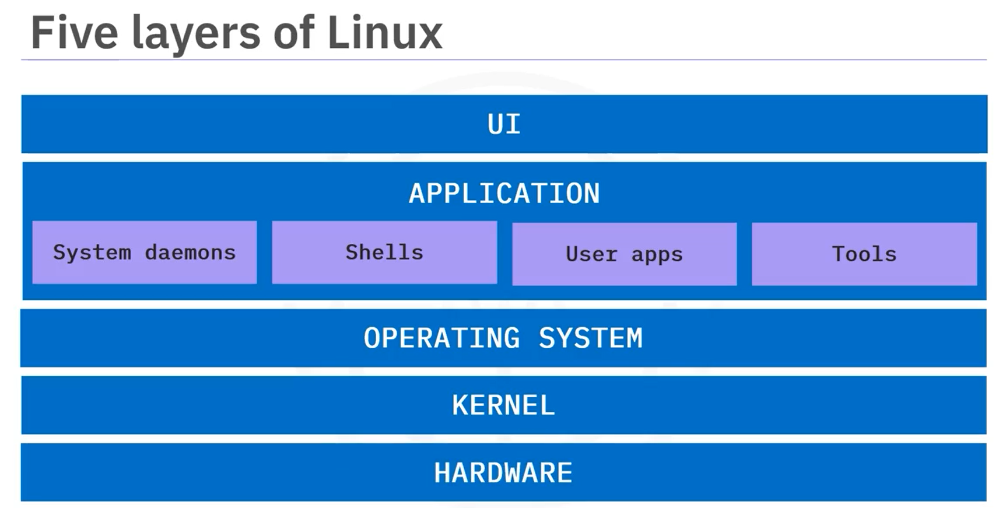

# Five layers of Linux

1. UI: User interface
   - Allows users to interact with the machine
   - GUI
2. Applications
   Any software that lets you perform a task
   Applications include:
   - System tools
   - Programming languages 
   - Shells
   - User apps(such as browsers, text editors)
3. Operating System
   Controls the jobs and programs vital to health and stability
   Functions:
   - Assigns software to users
   - Helps detect errors and prevent failures
   - Performs file management tasks
4. Kernel
    - Performs vital operations
    - Lowest-level software
    - Starts on boot
    - Bridge between apps and Hardware
    Key jobs:
    - Memory management
    - Process management
    - Device drivers
    - Security
5. Hardware
   Consists of all physical or electronic devices on your PC
   Includes:
   - CPU
   - RAM
   - Storage
   - Screen
   - USB devices

# Filesystem

- /bin: contains user binary files
- /usr: contains user programs
- /home: your personal working directory where you should store all your personal files
- /boot: contains your system boot files
- /media: contains files related to temporary media such as CD or USB drivers 